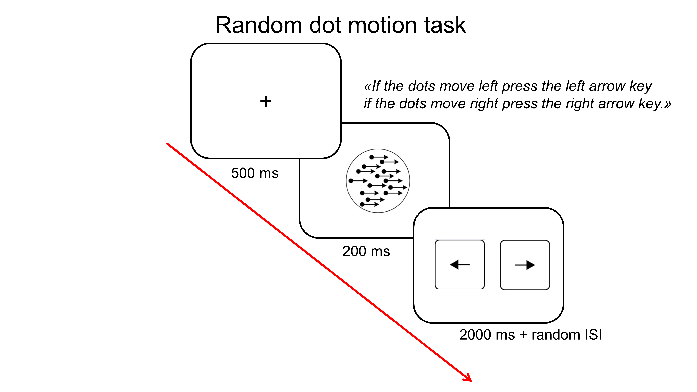
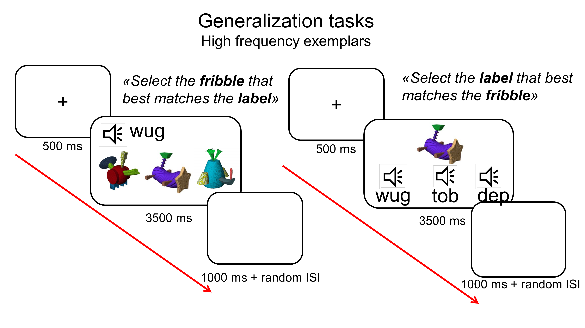
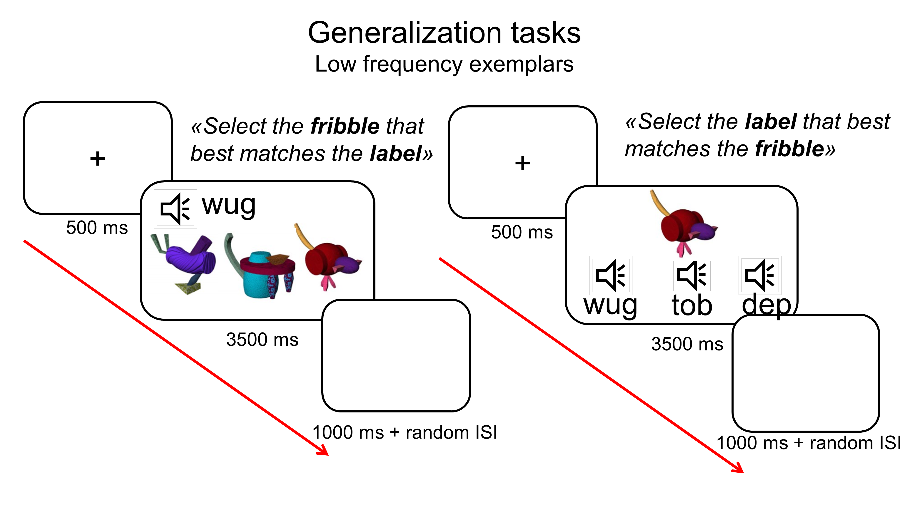
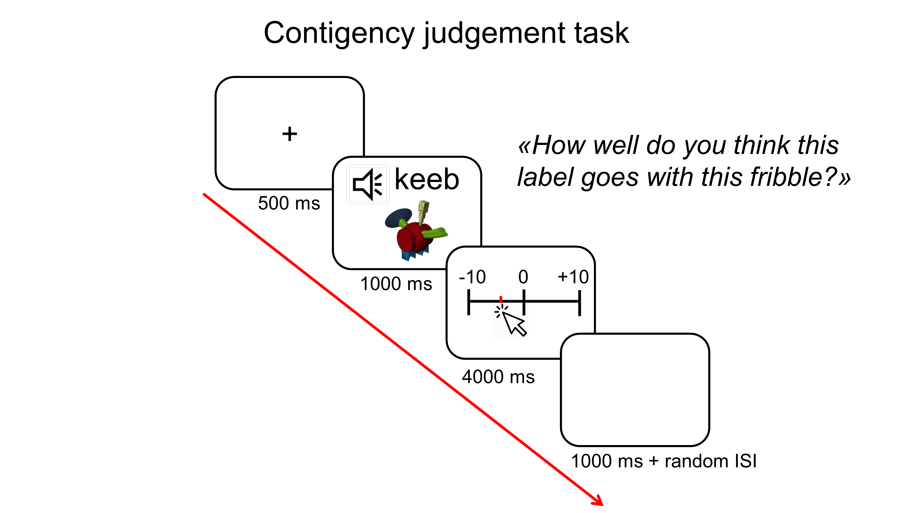

# Replication study

#### 1)	Main goal of this study: Replication with the addition of (1) a quality check task and (2) an additional test ####

In this study we aim to replicate Ramscar's 2010 FLO paper with the goal of finding a task that we can use to effectively filter those participants that do not pay attention. 
The idea is to establish that the paradigm works - i.e., we replicate the key interaction effect found in previous work 
despite these changes, as well as adding a task control that confirms that our data are solid.

#### 2)	Description of the key independent and dependent variable(s), specifying how they will be measured. ####
This is a 2x2 between design where learning (LF,FL) and frequency (highFreq, lowFreq) are manipulated in the following way.

Independent variables: 

Learning:
-	Label-to-Feature (LF) learning, i.e., learning to predict the objects from the labels
-	Feature-to-Label (FL) learning, i.e., learning to predict the labels from the objects

Frequency:
-	High frequency exemplars (highFreq): 75% of exemplars are made of a high salient feature specific of that subcategory
-	Low frequency exemplars (lowFreq): 25% of exemplars are drawn from another subcategory and have a different salient feature

Dependent variables: 

Accuracy on a speeded three-alternative forced choice test (3AFC) where participants:
- Match an unseen exemplar to the three category labels (24 trials)
- Match a label with three unseen exemplars (24 trials)
 
Judgement ratings where participants estimate the strength of the association between a label and an unseen exemplar. (24 trials)

#### 3)	Hypothesis: ####
Predictions are guided by modelling and previous experiments described in Ramscar 2010 study and Masa’s 4a experiments. 
We predict a training by frequency interaction.

-	H1: difference between high and low frequency condition for LF learners but not for FL learners.
-	H0: no difference between high and low frequency condition

#### 4)	Positive controls or quality checks  that will confirm that the obtained results are able to provide a fair test of the stated hypothesis. ####

We are going to introduce a task independent to our main hypothesis in order to have a tool to filter out bad participants.

This task is a random dot motion mini experiment (20 trials) where participants will be presented with a random number of black dots on a white background moving in one direction (left or right). 
They are asked to estimate and report dots' direction in a given time (2s). 100% of the dots move coherently in one direction, so the task is extremely easy no matter the age and visual acuity of the participants (See Hutchinson, C. V., Arena, A., Allen, H. A., & Ledgeway, T. (2012). Psychophysical correlates of global motion processing in the aging visual system: a critical review. Neuroscience & Biobehavioral Reviews).
This task is going to be presented to participants on a pseudo-random basis for a maximum of 4 times during the learning phase. 
We will exclude participants on the basis of how many timeouts they had during the whole experiment, fixing a max to 2, but not on the performance of the task. 
This will guarantee us that participants payed attention at least for half of the learning.

#### 5)	Method and materials #### 

Stimuli

The choice of the fribbles is based on Ramscar 2010 paper, but we avoid having the control category because in Vujovic et al., 2019 wasn't effective/informative.
Three experimental ‘‘fribble’’ categories are constructed in a way that match the
categories used in the simulations (see simulation on github https://github.com/n400peanuts/leverhulmeNDL). Each category is comprised of two subcategories (highFreq and lowFreq) both clustered around a high-saliency nondiscriminating feature, that is the central body shape, and a set of low-saliency discriminating features attached to it. The main idea is that learners in order to discriminate unambiguously across categories have to rely on the discriminating features more than the central body shape. 

For example, in figure 1, category 1 has the subcategory 1.1 clustered around the red barrel-like shape, while subcategory 1.2 is clustered around the blue jar-like shape. 
Each discriminating feature circled in red attached to the central body is uniquely assigned to the specific subcategory, so that no discriminating feature was shared within and across categories and subcategories. On the other hand, the non-discriminating feature, i.e., the central body, is shared across categories in the following way: body shapes belonging to the lowFreq subcategory exemplars in one category are used to build highFreq subcategory exemplars in another category. 

The number of fribbles is based on Ramscar 2010: we have 15 High frequency and 5 Low frequency exemplars per category. 60 exemplars in total repeated two times during the learning.
Fribbles used for testing are all unseen fribbles.
The selection of the learning and testing fribbles is randomised across participants.
The core set of stimuli is provided in the **[stimuli](https://github.com/n400peanuts/leverhulmeNDL/tree/master/exp1/stimuli)** folder.

Learning routines (5 min)

The timeline of the Learning routines are based on Ramscar 2010 as well as the number of repetitions (x2). The fribbles are going to be learned with their paired labels in two different paradigms. 
One is the Label-to-Feature (LF) learning where participants hear the label first and then see the object, and the other is Feature-to-Label (FL) learning where object is displayed before the label is pronounced. 
The exact timeline for the presentation of each novel fribble for the two learning routines is illustrated in Figure 2 below.

Exemplars will be interspersed in a semi-randomized order so that the categories are presented in a nonpredictable sequence. 
Total numer of trials is 120 divided in four blocks of different lengths. At the end of each block participants are presented with the random dot motion task.
Practice trials are 4 trials with fribbles and labels not present during learning in order not to influence learning.

Testing (8 min in total)

Generalization is assessed through two tasks.
These tasks are the same as described in Ramscar (2010) and aim at probing the ability of the participants to generalise the cue-outcome association to novel exemplars. 
Participants match a label to four unseen exemplars drawn from each category in the first task, subsequently they match unseen exemplar to the three category labels in the second task.
The order of presentation is counterbalanced across participants.
To limit participants’ ability to learn by contrasting between similar exemplars during testing, testing trials are composed either of all low-frequency or of all high-frequency exemplars separately. 
Participants are instructed to respond as quickly as possible (3500ms timeout). 

Timelines of the tasks for high and low frequency exemplars:

- Stimuli of the label to pictures matching: 12 high and 12 low frequency unseen exemplars are randomly presented with one of the three labels. HF and LF categories are tested 12 times each, 24 trials in total. 
Labels are repeated 8 times each. Pictures are never repeated. 

- Stimuli of the picture to labels matching: 4 high and 4 low frequency unseen exemplars are presented with the three labels. Order of the labels playes is randomised. HF and LF categories are tested 12 times each, 24 trials in total.

If there is no difference between the two generalization tasks, we can merge them together and have 48 trials per participant.

The final task is a contingency judgement task (Kopp and Wolff, 2000 *Biological Psychology*). 
The aim of this test is to probe 1. generalization of the cue-outcome association and 2. obtain a measure that might be compared with the positive/negative weights of the computational model. 
Subjects are presented with unseen fribbles + label and are asked to estimate the strength of their association. 

Instructions: You are going to see one novel alien on the screen and hear a name. Your job is to use the sliding scale to say whether you think the word 
is the correct label for the picture. Use a scale from -100 to +100, where +100 means you are really sure it’s the correct label, -100 means you are really sure it ISN’T the correct label and 0 means you don’t know.

Stimuli: 4 high and 4 low frequency unseen exemplars are presented with one label. HF and LF categories are tested 12 times each, 24 trials in total. Labels are repeated 8 times each.

