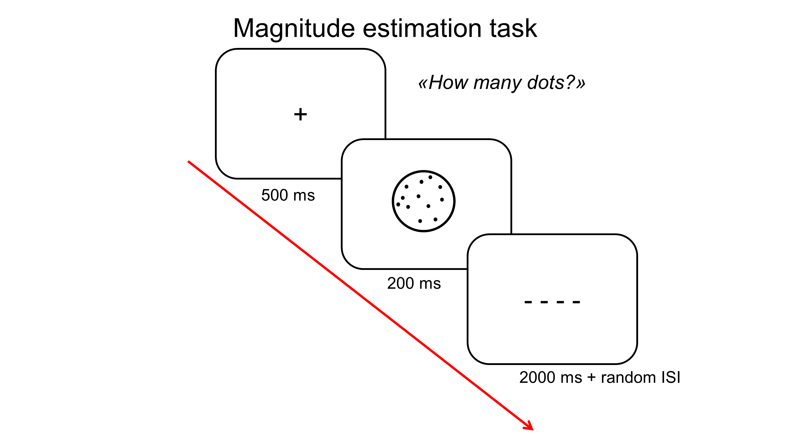
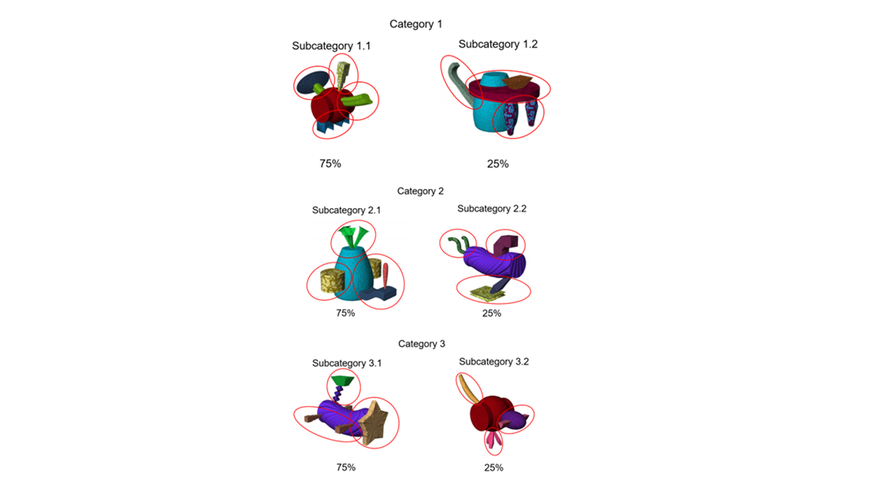
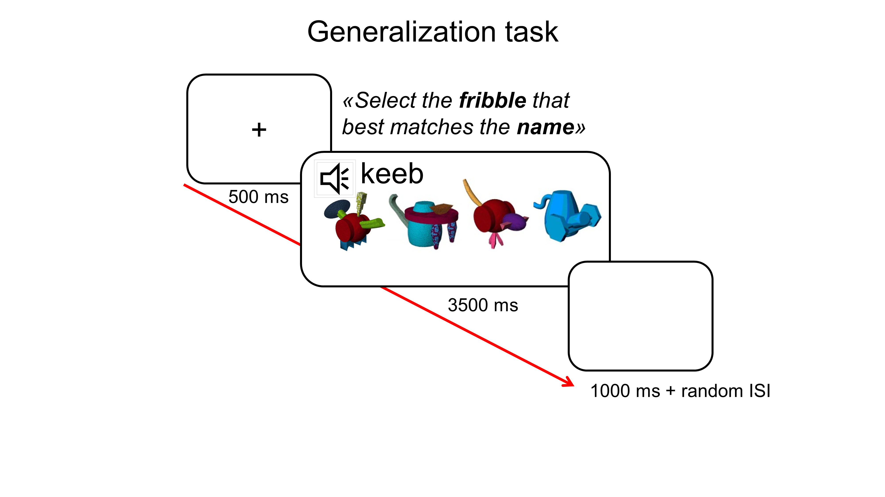

# Replication study

#### 1)	Main question addressed in this study: does the order by which cues are presented affect learning? ####

Learning is all about discrimination via cues competition, and the order by which the information is available to a learner affects learning. Discrimination learning is facilitated when objects predicts labels, but not when labels predict objects. When objects predict labels all possible features are evaluated and compete for relevance, this results in a process of “narrowing down” the most predictive feature that unambiguously predicts a label. On the other hand, when labels predict objects, because of the sparse nature of the features of the labels, the competition process is inhibited.

#### 2)	Description of the key independent and dependent variable(s), specifying how they will be measured. ####
This is a 2x2 between design where learning (LF,FL) and frequency (highFreq, lowFreq) are manipulated in the following way.

Independent variables: 

Learning:
-	Label-to-Feature (LF) learning, i.e., learning to predict the objects from the labels
-	Feature-to-Label (FL) learning, i.e., learning to predict the labels from the objects

Frequency:
-	High frequency exemplars (highFreq): 75% of exemplars are made of a high salient feature specific of that subcategory
-	Low frequency exemplars (lowFreq): 25% of exemplars are drawn from another subcategory and have a different salient feature

Dependent variable: 

Accuracy on a speeded two-alternative forced choice test (2AFC) on:
-	Previous learned stimuli/labels (explicit memory) and 
-	Novel unseen stimuli (generalization).

#### 3)	Hypothesis: ####
Predictions are guided by modelling and previous experiments described in Ramscar 2010 study and Masa’s 4a experiments. We predict a main effect of training and exemplars’ frequency respectively, and a training by frequency interaction.
-	H1: difference between trainings in the low frequency condition, with LF learners showing poorer generalization than FL. 
-	H0: no difference between high and low frequency condition

#### 4)	Positive controls or quality checks  that will confirm that the obtained results are able to provide a fair test of the stated hypothesis. ####

We are going to introduce a task independent to our main hypothesis test. 
This task is going to be a nonverbal counting task where participants will be presented with a random number of white dots on a black background for around 150ms, and asked to estimate and report the number of dots in a given time (around 2s). 
This task is going to be presented to participants on a pseudo-random basis for a maximum of 4 times while performing the core experiment. 
We will record their magnitude estimation from this task however we will exclude participants on the basis of how many timeouts they had during the whole experiment, fixing a max to 2. 
This will guarantee us that participants payed attention to the experiment at least half of the time.

#### 5)	Method and materials #### 

Stimuli

Three experimental ‘‘fribble’’ categories are constructed in a way that match the
categories used in the simulations (see simulation on github https://github.com/n400peanuts/leverhulmeNDL). Each category is comprised of two subcategories (highFreq and lowFreq) both clustered around a high-saliency nondiscriminating feature, that is the central body shape, and a set of low-saliency discriminating features attached to it. The main idea is that learners in order to discriminate unambiguously across categories have to rely on the discriminating features more than the central body shape. 

For example, in figure 1, category 1 has the subcategory 1.1 clustered around the red barrel-like shape, while subcategory 1.2 is clustered around the blue jar-like shape. 
Each discriminating feature circled in red attached to the central body is uniquely assigned to the specific subcategory, so that no discriminating feature was shared within and across categories and subcategories. On the other hand, the non-discriminating feature, i.e., the central body, is shared across categories in the following way: body shapes belonging to the lowFreq subcategory exemplars in one category are used to build highFreq subcategory exemplars in another category. 

A set of 48 fribbles are selected in total and divided in two lists. 
One list is trained and the other is untrained. 
The assignment of these lists to training condition is going to be counterbalanced across participants. 
There are 8 fribble exemplars per category (6 highFreq, 2 lowFreq) for a total of 24 fribbles per set.
The core set of stimuli is provided in X (to come).

Learning routines (10 min)

The fribbles are going to be learned with their paired labels in two different paradigms. 
One is the Label-to-Feature (LF) learning where participants hear the label first and then see the object, and the other is Feature-to-Label (FL) learning where object is displayed before the label is pronounced. 
The exact timeline for the presentation of each novel fribble for the two learning routines is illustrated in Figure 2 below.
Stimuli presentation at 175ms is chosen to minimize the participants possibility to strategize. 
Exemplars will be interspersed in a semi-randomized order so that the categories were presented in a nonpredictable sequence.
Training will consist in two identical blocks, with a short rest between the blocks.
Each fribble will be trained 8 times (8 exemplars x 8 times = 64) per category (x3), for a total of 192 training trials (7.5 min).
Practice trials will be 5 or 10 trials (it depends by participant's confidence) with objects and labels not present during learning.

Testing 

Learning and generalization will be assessed through two tasks, each tapping a different aspect of item-learning and the learning of discriminating features.

The first task is a *Generalization task* (around 10 min). 
This task is the same as described in Ramscar (2010) paper and it aims at probing the ability of the participants to generalise the cue-outcome association to novel exemplars. 
This is a speeded four alternative forced-choice task. 
Half the participants matched an unseen exemplar to the three category labels, and half matched a label to four previously unseen exemplars drawn from each category, plus control exemplars. 
To limit participants’ ability to learn by contrasting between similar exemplars during testing, testing trials were composed either of all low-frequency or of all high-frequency exemplars plus control exemplars. 
Control exemplars are unrelated and unseen objects. Participants are instructed to respond as quickly as they could (3500ms timeout). 
Each high frequency subcategory has 6 exemplars per category (6 x 4, three experimental and one control), while low frequency subcategory has 2 exemplars per category (2 x 4, three experimental and one control). 
Each subcategory (high/low frequency) will be tested X times each (I’m debugging Masa’s experiment as I can't find this info in her thesis, my fault probably).

The final task is a *Contingency judgement task* (5 min). 
The aim of this test is to probe participants explicit knowledge of the cue-outcome association. 
Subjects are presented with all trained fribbles presented one by one along with a label and are asked to estimate the likeliness that the fribble presented is associated to the name they hear. 
Instructions: “Please express your judgement of the likeliness of the association between the fribble and the name you hear. 
Use a scale from -10 to +10, where +10 is “it’s very likely that this is the fribble’s name” and -10 is “it’s not very likely that this is the fribble’s name”. 
Zero indicates that the association is not existent therefore you can’t make an estimate. 
Press next to familiarise with the task.” 
Stimuli will be all the trained fribbles belonging to the three categories (24) repeated once per label (x3), for a total of 72 trials. In addition, 8 unseen object foils will be displayed only once. 
These are novel objects for which participants should always report Zero, i.e., a judgement can't be make.
A random label will be matched to the foils. 
In total, there will be 72 experimental trials and 4 practice trials. Practice trials will be made of 2 known words (e.g., house, cat) and 2 unknown words (e.g., puly, fret) associated to two images of a house and a cat. 

